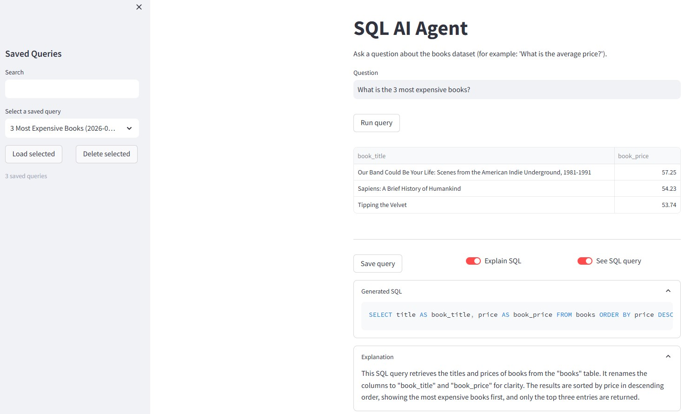

# SQL AI Agent

SQL AI Agent is a lightweight Streamlit app that turns natural-language questions into DuckDB SQL, applies safety checks, and returns results. It is designed to be simple, transparent, and easy to run locally.

## How it works
1. **Schema context**: the app inspects DuckDB tables and columns.
2. **SQL generation**: an LLM creates a single, read-only SQL query with explicit column aliases.
3. **Safety checks**: write operations and multi-statement queries are blocked.
4. **Execution**: DuckDB runs the query and Streamlit displays the results.
5. **Explain & save**: you can request a short explanation and save queries locally in SQLite.



---
## Requirements
- Python 3.10+ (recommended 3.11)
- DuckDB
- Streamlit

All dependencies are listed in `requirements.txt`.

## Environment variables
Create a `.env` file in the project root. You can start from `.env.example`.

Required:
- `OPENAI_API_KEY` - used to generate and explain SQL.

Optional:
- `DUCKDB_PATH` - path to the DuckDB file (default: `./data/dados.duckdb`)
- `FIRECRAWL_API_KEY` - only required if you use the scraping script
- `SAVED_QUERIES_DB` - path to the SQLite file for saved queries (default: `./data/saved_queries.db`)

## Quickstart
1. Create and activate a virtual environment.
2. Install dependencies:
   `pip install -r requirements.txt`
3. Copy the env file:
   `copy .env.example .env` (Windows) or `cp .env.example .env` (macOS/Linux)
4. Set `OPENAI_API_KEY` in `.env`.
5. Run the app:
   `streamlit run app/streamlit_app.py`

## Optional: rebuild the demo database
If you want to refresh the demo data (requires Firecrawl):
`python scripts/build_duckdb_from_scrape.py`

## Project structure
```
SQL_AI_Agent/
|-- app/
|   `-- streamlit_app.py
|-- src/
|   `-- sql_ai_agent/
|       |-- config.py
|       |-- db/
|       |-- llm/
|       |-- pipeline/
|       |-- safety/
|       |-- storage/
|       `-- utils/
|-- scripts/
|   `-- build_duckdb_from_scrape.py
|-- data/
|   |-- dados.duckdb
|   |-- saved_queries.db
|   `-- README.md
|-- tests/
|   |-- test_duckdb_client.py
|   `-- test_sql_safety.py
|-- .env.example
|-- .gitignore
|-- requirements.txt
`-- README.md
```

## Limitations
- Saved queries are stored locally in a SQLite file and are shared by anyone using the same machine.
- There is no authentication, user separation, or role-based access control.
- The SQL safety guardrails are lightweight and only enforce read-only, single-statement queries.
- The demo data is intentionally small and scraped from a public source.

## Next step
Add user accounts and store saved queries in a dedicated multi-user database or remote service so that data can be shared safely across devices.
